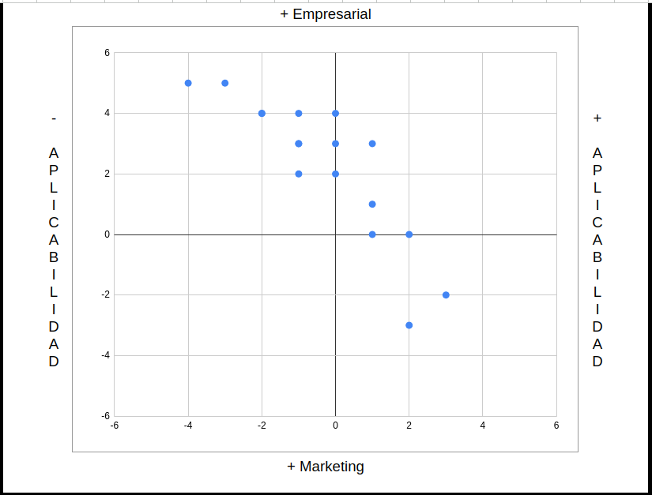

# Aplicabilidad

*[Hoja de análisis](https://docs.google.com/spreadsheets/d/1v7f3ir2PGQAOVarcQ9QgSPiH26DJTFrJDtRCoGRsGe4/edit?usp=sharing)*

Puede ser interesante ordenar los marcos de trabajo en función de su rigor empresarial, comenzando por los que son más rigurosos y basados en análisis cuantitativos y/o cualitativos profundos, y dejando luego aquellos que tienden a ser más generales y pueden incluir un componente más fuerte de marketing o sean más orientados a la conceptualización.

La clasificación se realiza considerando el enfoque, la aplicación y la profundidad de análisis que cada uno requiere, refleja una tendencia general y debe adaptarse según el contexto específico y los objetivos de la empresa.

> Fijarse en qué posición quedan herramientas como el Lienzo de Modelo de Negocio y el análisis DAFO, herramientas muy populares y útiles para la conceptualización y la comunicación de ideas clave en una variedad de contextos empresariales.

## El concepto de aplicabilidad práctica

Para complementar las dimensiones de "empresarial" y "marketiniano" planteada, se agrega la dimensión de "Aplicabilidad práctica". Esta dimensión evalúa cada marco en términos de su facilidad de implementación y la inmediatez con la que puede traducirse en acciones concretas dentro de una organización.

- **Facilidad de implementación**: Evalúa cuán sencillo es para una empresa de cualquier tamaño aplicar el marco de trabajo en su operación diaria sin necesidad de recursos extensivos o conocimientos especializados. Herramientas con una alta facilidad de implementación son accesibles para una amplia gama de empresas, incluidas startups y PYMEs.
- **Inmediatez de impacto**: Considera el tiempo que tarda en observarse un impacto tangible después de aplicar el marco de trabajo. Algunos marcos pueden conducir a mejoras rápidas en áreas específicas, mientras que otros requieren una visión a largo plazo para apreciar su efecto completo.
- **Versatilidad**: Mide la capacidad del marco para adaptarse a diferentes industrias, mercados y situaciones empresariales. Un marco versátil puede ser aplicado en una variedad de contextos con modificaciones mínimas.
- **Profundidad de análisis requerida**: Evalúa el nivel de detalle y profundidad que el marco exige para ser efectivamente implementado. Algunos marcos pueden requerir un análisis exhaustivo y recopilación de datos, mientras que otros pueden ser aplicados con una comprensión básica de la situación.

Integrando la dimensión de "Aplicabilidad práctica" en la clasificación, se obtiene una perspectiva contextualizada de los marcos, ayudando a seleccionar aquellos que no solo se alinean con sus necesidades estratégicas y de marketing, sino que también son prácticos y factibles de implementar en su contexto específico.
