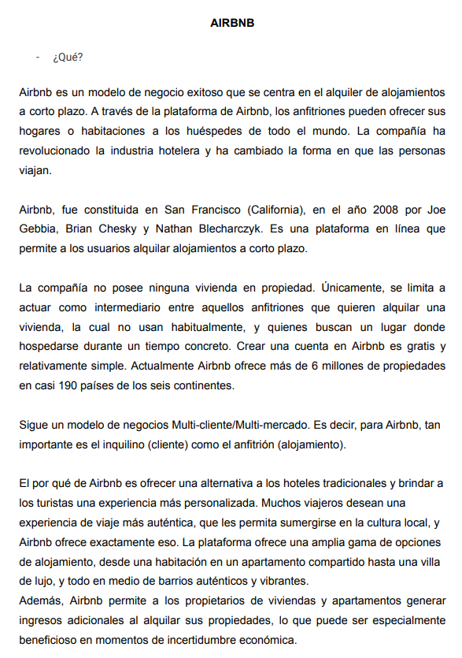
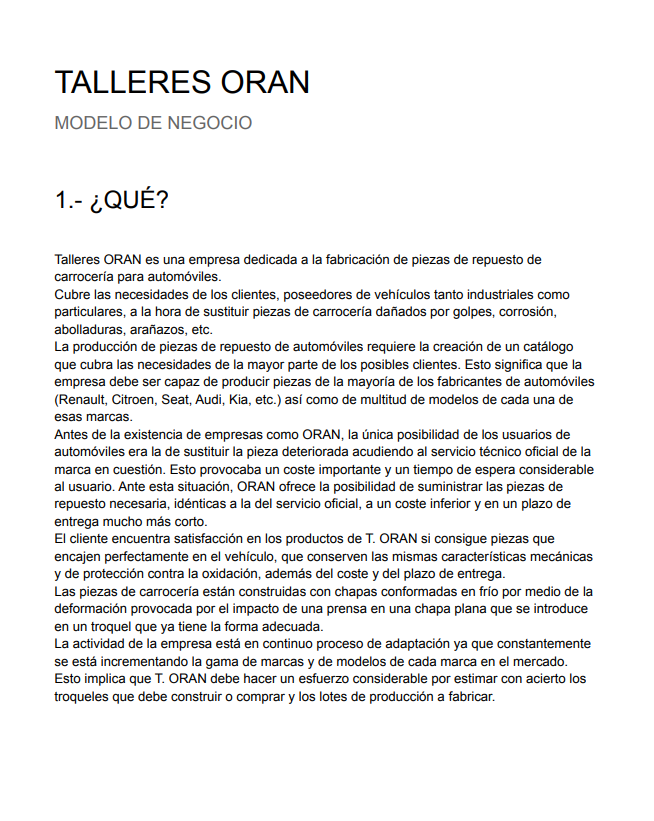
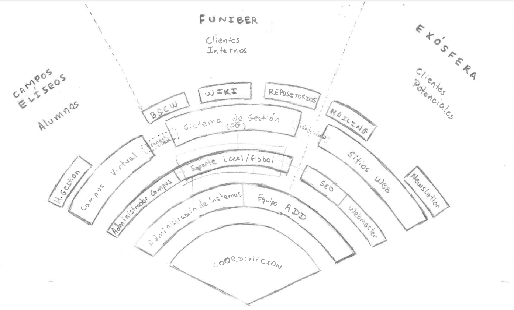

# Herramientas y Marcos de trabajo

## ¿Por qué?

### Evaluación contínua

A la propuesta de [contar la realidad de una empresa](/retos/02-modeloDeNegocio.md):

Modelo 1|Modelo 2|Modelo 3|Modelo 4|
-|-|-|-
|||

- **Eficaz**: seguro que sí.
- **Eficiente**: podemos discutirlo...

### Evitar ambigüedades en la comunicación

|||
|-|-|
|La misma persona interpreta lo mismo del mismo diagrama pasado el tiempo, una servilleta con un garabato sin estandarizar, …​|distintas personas interpretan lo mismo del mismo diagrama, transparencias / diapositivas / …​ muy bonitas sin estandarizar, …​|

## ¿Qué?

- Información / Ideas
- Eficiencia
- Trabajo colaborativo
- Decisiones

## ¿Para qué?

Qué|Para qué
-|-
Información / Ideas|Estructurar
Eficiencia|Aumentar
Trabajo colaborativo|Dinamizar
Decisiones|Ayudar

- Para desarrollar y visualizar su modelo de negocio. 
- Ayuda a entender las partes clave de un modelo de negocio y cómo se relacionan entre sí.

## ¿Cómo?
Qué|Cómo
-|-
Estructuran la información y las ideas|Los marcos de trabajo proporcionan una estructura y un lenguaje común para describir, analizar y comunicar la información y las ideas de manera clara y concisa.
Aumentan la eficiencia|Los marcos de trabajo estandarizados y probados pueden ahorrar tiempo y recursos, ya que no es necesario reinventar la rueda cada vez que se enfrenta a un problema o se desarrolla una estrategia.
Permiten la colaboración y la alineación|Los marcos de trabajo comunes pueden ayudar a alinear a los equipos y partes interesadas en torno a objetivos y planes compartidos, lo que puede fomentar la colaboración y la toma de decisiones más efectiva.
Ayudan a tomar decisiones|Al proporcionar una perspectiva estructurada y sistemática sobre la situación de una empresa y sus opciones estratégicas, los marcos de trabajo facilitan la toma de decisiones informadas.

## A tener en cuenta

### Conceptos recurrentes en estas herramientas

No todos, no en todas, no todos conocidos. 

Punto|Coma
-|-
Valor propuesto|Cómo la empresa genera valor para sus clientes y cómo se diferencia de la competencia.
Segmentos de mercado|Cómo la empresa planea llegar a sus clientes objetivo.
Canales de distribución|Cómo la empresa planea llegar a sus clientes, incluyendo el uso de intermediarios o el uso directo.
Fuentes de ingresos|Cómo la empresa planea generar ingresos, incluyendo precios, volúmenes y estructuras de precios.
Costos y estructura de costos|Los costos asociados con la producción y distribución de productos o servicios, incluyendo costos variables y fijos.
Actividades clave|Actividades que la empresa debe realizar para hacer que su modelo de negocio funcione, incluyendo producción, marketing, ventas, entrega, servicio al cliente, entre otros.
Recursos clave|Identificación de los recursos clave, incluyendo personas, tecnologías y procesos, necesarios para hacer que el modelo de negocio funcione.
Alianzas clave|Alianzas clave que la empresa planea establecer para apoyar su modelo de negocio.

### [Algunos marcos de trabajo](marcosDeTrabajoVademecum.md)

### Limitaciones

|Falta de rigor en el análisis|Falsa sensación de seguridad en la toma de decisiones|Falta de flexibilidad en la planificación estratégica|
-|-|-
La tentación de reducir un problema complejo a un conjunto limitado de factores puede llevar a omitir información importante y subestimar la complejidad de la situación. Además, al enfocarse en solo unas pocas áreas de interés, se corre el riesgo de pasar por alto factores importantes que pueden afectar la situación de la empresa u organización.|Cuando se utilizan herramientas simplificadas, es posible que las personas subestimen la complejidad de la situación y tomen decisiones precipitadas que pueden tener consecuencias negativas a largo plazo.|Si la situación de la empresa u organización es compleja, es posible que sea necesario tomar en cuenta una amplia gama de factores y considerar múltiples escenarios de futuro. 

<big>La simplicidad **aparente** puede ser su mayor peligro</big>

